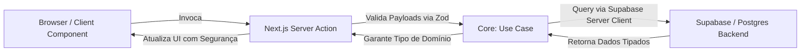

# 📑 Software Design Document (SDD) — Fullstack Base Template

## 1. Visão Geral e Objetivos

### 1.1 Contexto Técnico

Este documento especifica o design de um boilerplate fullstack opinativo, utilizando as tecnologias mais recentes do mercado de desenvolvimento web. O objetivo é servir como fundação aceleradora para projetos de produção e como portfólio técnico de nível Staff para processos seletivos.

### 1.2 Objetivos de Design

* **AI-Driven Development:** Arquitetura altamente tipada, modular e previsível, permitindo que agentes de IA (Cursor, Cline, Copilot) operem sem gerar alucinações de código.
* **Isolamento de Infraestrutura (Backend-Encapsulated):** Nenhuma credencial direta do banco de dados (PostgreSQL) deve vazar para o Client-side. Toda a comunicação com dados é centralizada na camada de servidor do Next.js.
* **Maturidade Arquitetural:** Separação clara entre regras de negócio (Domínio) e detalhes técnicos de entrega (Framework/Infraestrutura).

---

## 2. Stack Tecnológica e Ferramental

| Camada | Tecnologia | Justificativa |
| --- | --- | --- |
| **Framework** | Next.js 15 (App Router) | Uso nativo de React Server Components (RSC) e Server Actions para performance. |
| **Linguagem** | TypeScript (Strict Mode) | Garantia de segurança em tempo de compilação e tipagem de ponta a ponta. |
| **Estilização** | Tailwind CSS + Shadcn/ui | Sistema de design modular baseado em componentes utilitários copiáveis, sem dependência de pacotes pesados. |
| **Banco de Dados** | Supabase (PostgreSQL) | Solução robusta escalável com suporte nativo a Row Level Security (RLS). |
| **Acesso a Dados** | Supabase Client (`@supabase/ssr`) | Consumo via HTTP/PostgREST otimizado para ambientes Serverless/Edge, com tipos gerados via CLI. |
| **Validação** | Zod | Definição de contratos de runtime para payloads de API, formulários e entidades. |

---

## 3. Arquitetura de Software

O template adota um modelo **DDD-Lite combinado com Clean Architecture**, dividindo o código fonte (`src/`) em quatro camadas fundamentais e isoladas.

```text
src/
├── app/          # Camada de Apresentação & Roteamento (Next.js)
├── core/         # Camada de Domínio & Regras de Negócio (Pure TS)
├── infra/        # Camada de Infraestrutura & Adaptadores (Supabase, Clients)
└── shared/       # Camada Transversal (Utils, Hooks Comuns)

```

### 3.1 Detalhamento das Camadas

#### A. Camada de Apresentação e Roteamento (`src/app`)

Responsável estritamente pela UI, layouts, rotas de API e Server Actions.

* **Regra de Ouro:** Não executa lógica de negócio complexa diretamente. Ela apenas intercepta a requisição, valida o input básico e chama a camada de `core`.
* Utiliza React Server Components por padrão. Componentes interativos (`'use client'`) devem ser isolados em arquivos atômicos dentro de `src/components/ui`.

#### B. Camada de Domínio (`src/core`)

O coração do software. Contém código TypeScript puro, sem dependências de frameworks, bibliotecas de UI ou clients de banco de dados.

* **`src/core/entities`:** Contém as validações de esquema Zod e as definições de tipo derivadas.
* **`src/core/use-cases`:** Classes ou funções puras que orquestram fluxos específicos da aplicação (ex: `CreateUserAccount`, `ProcessPayment`).

#### C. Camada de Infraestrutura (`src/infra`)

Onde residem as integrações com serviços externos.

* Contém a configuração do `@supabase/ssr` segregada em `server.ts` (para RSC/Actions) e `client.ts` (para Client Components).
* Contém o arquivo `types.ts` gerado pelo Supabase CLI que mapeia o banco físico.

---

## 4. Fluxo de Dados e Segurança

Para atingir o objetivo de **encapsulamento total do banco no backend**, o fluxo de mutação e consulta deve seguir estritamente o pipeline abaixo:



1. O cliente interage com a interface e aciona uma **Server Action**.
2. A Server Action valida os dados de entrada usando o schema do **Zod** (`safeParse`). Em caso de falha, rejeita imediatamente antes de tocar na infraestrutura.
3. A Action chama a função do `core/use-cases`.
4. O caso de uso utiliza o client do Supabase instanciado no servidor (`@supabase/ssr`) para executar a operação no banco. A string de conexão e os tokens administrativos ficam guardados em variáveis de ambiente não-públicas (`process.env.SUPABASE_SERVICE_ROLE_KEY` se necessário).

---

## 5. Diretrizes para AI Agents (Contextualização)

Para maximizar a utilidade de ferramentas como Cursor e Cline, este projeto implementa contratos estritos que servem como metadados legíveis por máquinas.

### 5.1 Regras de Operação de IA

* **Análise de Impacto de Schema:** Antes de propor ou codificar uma nova query, o agente *deve* ler `src/infra/supabase/types.ts` para inferir as colunas corretas.
* **Princípio do Arquivo Único por Feature:** Novas features de UI devem ter componentes criados de forma modular. Não jogue toda a lógica em um arquivo `page.tsx` gigante.
* **Uso Obrigatório de Zod:** O agente está proibido de receber inputs do front-end em Server Actions sem passar por um validador Zod correspondente no diretório `src/core/entities`.

---

## 6. Plano de Implementação (Bootstrap)

A execução da montagem deste template seguirá as etapas abaixo:

* [x] **Milestone 1:** Inicialização do Next.js 15, TypeScript Strict e Tailwind.
* [ ] **Milestone 2:** Instalação e configuração do Shadcn/ui com temas base.
* [ ] **Milestone 3:** Configuração da infraestrutura do Supabase (`@supabase/ssr`), geração do primeiro arquivo de tipos e isolamento dos arquivos `server.ts` e `client.ts`.
* [ ] **Milestone 4:** Criação do pipeline de exemplo (Rota de API + Server Action + Use Case + Validação Zod).
* [ ] **Milestone 5:** Criação do arquivo `.cursorrules` baseado no SDD.